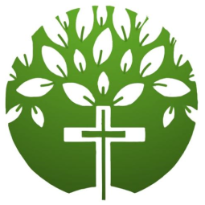

<!-- markdownlint-disable-next-line MD033 -->
#  Living Streams Christian Church – Official Website

[](https://lscc.org.sg) [](https://statamic.com) [](https://github.com/barnabas243/lscc-website/commits/main) [](LICENSE)

> Encounter God in Life · Arise to Share the Gospel 💧✨

Hey there 👋 — welcome to the code home of **Living Streams Christian Church (Singapore)**!  
This is where our website lives, grows, and occasionally gets a little makeover.  
Think of this repo as our **digital bulletin board**, **event calendar**, and **workshop** all rolled into one.

## 📖 What’s This All About?

Our website is here to:

- 🌐 **Connect** our church family and new friends online
- 📣 **Share** announcements, events, and service details
- ❤️ **Serve** as a hub for our ministries and opportunities

Whether you’re a developer tweaking the code, or a ministry leader looking for an event update — you’re in the right place.

## ✨ What You’ll Find Here

- 🏠 **Home Page** – Our mission, vision, and values  
- 📅 **Events Calendar** – All upcoming services & church happenings  
- 🤝 **Ministries & Opportunities** – How you can get involved  
- 📍 **Contact & Location** – Directions, contact info, and office hours  

## 🛠 How It’s Built

| Part           | Tech |
|----------------|------|
| **CMS**        | [Statamic](https://statamic.com) |
| **Hosting**    | [Hetzner](https://www.hetzner.com) |
| **Deployment** | [Ploi.io](https://ploi.io) |
| **Frontend**   | Tailwind CSS + Alpine.js |

## 🚀 Let’s Get You Set Up (For Developers)

### You’ll Need

- PHP **^8.1**
- Composer
- Node.js & npm
- Git

### Steps

```bash
# Clone this repo
git clone https://github.com/barnabas243/lscc-website.git
cd lscc-website

# Install PHP dependencies
composer install

# Install frontend goodies
npm install && npm run dev

# Run locally
php artisan serve
```

## 💌 Talk to Us

We love hearing from you — ideas, feedback, even typo fixes are welcome! 💬

- 🐛 **Report an Issue / Suggest a Feature:** [GitHub Issues](https://github.com/barnabas243/lscc-website/issues)  
- 📧 **Email:** [barnabas.tan@lscc.org.sg](mailto:barnabas.tan@lscc.org.sg)  
- 🌐 **Website:** [lscc.org.sg](https://lscc.org.sg)
